# Entity-Relationship Diagram — Sistema de Inventario Multi-Sucursal

> Versión actualizada del DER de `requirements/Prototipo_DB.pdf`, incorporando los cambios acordados en `requirements/Analisis_Requerimientos.md` (sección 9.4) y el cambio de roles de `ENUM` a tabla maestra (`requirements/Decisiones_Arquitectura.md`, ADR-006).
> Convención de nombres: identificadores de tabla/columna en **inglés**, con prefijo de categoría — `MA_` (Master/maestro), `TR_` (Transactional/transaccional), `SY_` (System/sistema). El texto descriptivo de este documento está en español, consistente con el resto de `requirements/`.
> Este documento es la referencia previa al script DDL (tarea siguiente del backlog) — el DDL debe ser coherente con lo que aquí se define, columna por columna.

**26 tablas en total** — 20 del prototipo original, 6 nuevas (`SY_NOTIFICATIONS`, `SY_AUDIT_LOG`, `MA_USER_BRANCH`, `MA_CUSTOMERS`, `SY_REFRESH_TOKENS`, `MA_ROLES`).

---

## 1. Diagrama de relaciones

Por legibilidad, cada entidad muestra solo su clave primaria y sus llaves foráneas — el detalle completo de columnas está en la sección 3.

```mermaid
erDiagram
    MA_ROLES { bigint id PK }
    MA_BRANCHES { bigint id PK }
    MA_USERS { bigint id PK
        bigint role_id FK }
    MA_USER_BRANCH { bigint id PK
        bigint user_id FK
        bigint branch_id FK }
    SY_REFRESH_TOKENS { bigint id PK
        bigint user_id FK }
    MA_CATEGORIES { bigint id PK }
    MA_UNITS { bigint id PK }
    MA_PRODUCTS { bigint id PK
        bigint category_id FK
        bigint base_unit_id FK }
    MA_PRODUCT_UNITS { bigint id PK
        bigint product_id FK
        bigint unit_id FK }
    TR_INVENTORY { bigint id PK
        bigint branch_id FK
        bigint product_id FK }
    TR_INVENTORY_MOVEMENTS { bigint id PK
        bigint branch_id FK
        bigint product_id FK
        bigint responsible_user_id FK }
    MA_SUPPLIERS { bigint id PK }
    TR_PURCHASE_ORDERS { bigint id PK
        bigint supplier_id FK
        bigint branch_id FK
        bigint user_id FK }
    TR_PURCHASE_ORDER_ITEMS { bigint id PK
        bigint purchase_order_id FK
        bigint product_id FK }
    TR_PURCHASE_RECEIPTS { bigint id PK
        bigint purchase_order_id FK
        bigint user_id FK }
    TR_PURCHASE_RECEIPT_ITEMS { bigint id PK
        bigint receipt_id FK
        bigint purchase_order_item_id FK }
    MA_CUSTOMERS { bigint id PK }
    MA_PRICE_LISTS { bigint id PK }
    MA_PRICE_LIST_ITEMS { bigint id PK
        bigint price_list_id FK
        bigint product_id FK }
    TR_SALES { bigint id PK
        bigint branch_id FK
        bigint price_list_id FK
        bigint seller_id FK
        bigint customer_id FK }
    TR_SALE_ITEMS { bigint id PK
        bigint sale_id FK
        bigint product_id FK }
    TR_TRANSFERS { bigint id PK
        bigint origin_branch_id FK
        bigint destination_branch_id FK
        bigint requested_by FK }
    TR_TRANSFER_ITEMS { bigint id PK
        bigint transfer_id FK
        bigint product_id FK }
    TR_TRANSFER_EVENTS { bigint id PK
        bigint transfer_id FK
        bigint recorded_by FK }
    SY_NOTIFICATIONS { bigint id PK
        bigint branch_id FK
        bigint product_id FK
        bigint recipient_user_id FK }
    SY_AUDIT_LOG { bigint id PK
        bigint user_id FK }

    MA_ROLES ||--o{ MA_USERS : ""
    MA_BRANCHES ||--o{ MA_USER_BRANCH : ""
    MA_USERS ||--o{ MA_USER_BRANCH : ""
    MA_USERS ||--o{ SY_REFRESH_TOKENS : ""
    MA_CATEGORIES ||--o{ MA_PRODUCTS : ""
    MA_UNITS ||--o{ MA_PRODUCTS : "base unit"
    MA_PRODUCTS ||--o{ MA_PRODUCT_UNITS : ""
    MA_UNITS ||--o{ MA_PRODUCT_UNITS : ""
    MA_BRANCHES ||--o{ TR_INVENTORY : ""
    MA_PRODUCTS ||--o{ TR_INVENTORY : ""
    MA_BRANCHES ||--o{ TR_INVENTORY_MOVEMENTS : ""
    MA_PRODUCTS ||--o{ TR_INVENTORY_MOVEMENTS : ""
    MA_USERS ||--o{ TR_INVENTORY_MOVEMENTS : "responsible"
    MA_SUPPLIERS ||--o{ TR_PURCHASE_ORDERS : ""
    MA_BRANCHES ||--o{ TR_PURCHASE_ORDERS : ""
    MA_USERS ||--o{ TR_PURCHASE_ORDERS : ""
    TR_PURCHASE_ORDERS ||--o{ TR_PURCHASE_ORDER_ITEMS : ""
    MA_PRODUCTS ||--o{ TR_PURCHASE_ORDER_ITEMS : ""
    TR_PURCHASE_ORDERS ||--o{ TR_PURCHASE_RECEIPTS : ""
    MA_USERS ||--o{ TR_PURCHASE_RECEIPTS : ""
    TR_PURCHASE_RECEIPTS ||--o{ TR_PURCHASE_RECEIPT_ITEMS : ""
    TR_PURCHASE_ORDER_ITEMS ||--o{ TR_PURCHASE_RECEIPT_ITEMS : ""
    MA_PRICE_LISTS ||--o{ MA_PRICE_LIST_ITEMS : ""
    MA_PRODUCTS ||--o{ MA_PRICE_LIST_ITEMS : ""
    MA_BRANCHES ||--o{ TR_SALES : ""
    MA_PRICE_LISTS ||--o{ TR_SALES : ""
    MA_USERS ||--o{ TR_SALES : "seller"
    MA_CUSTOMERS ||--o{ TR_SALES : ""
    TR_SALES ||--o{ TR_SALE_ITEMS : ""
    MA_PRODUCTS ||--o{ TR_SALE_ITEMS : ""
    MA_BRANCHES ||--o{ TR_TRANSFERS : "origin"
    MA_BRANCHES ||--o{ TR_TRANSFERS : "destination"
    MA_USERS ||--o{ TR_TRANSFERS : "requester"
    TR_TRANSFERS ||--o{ TR_TRANSFER_ITEMS : ""
    MA_PRODUCTS ||--o{ TR_TRANSFER_ITEMS : ""
    TR_TRANSFERS ||--o{ TR_TRANSFER_EVENTS : ""
    MA_USERS ||--o{ TR_TRANSFER_EVENTS : "recorded by"
    MA_BRANCHES ||--o{ SY_NOTIFICATIONS : ""
    MA_PRODUCTS ||--o{ SY_NOTIFICATIONS : ""
    MA_USERS ||--o{ SY_NOTIFICATIONS : "recipient"
    MA_USERS ||--o{ SY_AUDIT_LOG : ""
```

---

## 2. Mapa de nombres: prototipo original → esquema actual

Para trazabilidad con `requirements/Prototipo_DB.pdf` y con las versiones previas de `requirements/Analisis_Requerimientos.md`:

| Nombre original (prototipo) | Nombre actual | Estado |
|---|---|---|
| — | `MA_ROLES` | **Nueva** |
| `SUCURSALES` | `MA_BRANCHES` | Renombrada, sin cambio de columnas |
| `USUARIOS` | `MA_USERS` | Renombrada + `role` (ENUM) → `role_id` (FK) + quita `branch_id` + agrega `updated_at` |
| `USUARIO_SUCURSAL` | `MA_USER_BRANCH` | **Nueva** (reemplaza `branch_id` único de usuarios) |
| — | `SY_REFRESH_TOKENS` | **Nueva** |
| `CATEGORIAS_PRODUCTO` | `MA_CATEGORIES` | Renombrada + agrega `updated_at` |
| `UNIDADES_MEDIDA` | `MA_UNITS` | Renombrada, sin cambio de columnas |
| `PRODUCTOS` | `MA_PRODUCTS` | Renombrada + agrega `updated_at` |
| `PRODUCTO_UNIDADES` | `MA_PRODUCT_UNITS` | Renombrada, sin cambio de columnas |
| `PROVEEDORES` | `MA_SUPPLIERS` | Renombrada + agrega `updated_at` |
| `CLIENTES` | `MA_CUSTOMERS` | **Nueva** |
| `LISTAS_PRECIOS` | `MA_PRICE_LISTS` | Renombrada + agrega `updated_at` |
| `LISTAS_PRECIOS_ITEMS` | `MA_PRICE_LIST_ITEMS` | Renombrada, sin cambio de columnas |
| `INVENTARIO` | `TR_INVENTORY` | Renombrada + agrega `max_stock` |
| `INVENTARIO_MOVIMIENTOS` | `TR_INVENTORY_MOVEMENTS` | Renombrada, sin cambio de columnas |
| `ORDENES_COMPRA` | `TR_PURCHASE_ORDERS` | Renombrada, sin cambio de columnas |
| `ORDENES_COMPRA_ITEMS` | `TR_PURCHASE_ORDER_ITEMS` | Renombrada, sin cambio de columnas |
| `RECEPCIONES_COMPRA` | `TR_PURCHASE_RECEIPTS` | Renombrada, sin cambio de columnas |
| `RECEPCIONES_COMPRA_ITEMS` | `TR_PURCHASE_RECEIPT_ITEMS` | Renombrada, sin cambio de columnas |
| `VENTAS` | `TR_SALES` | Renombrada + `customer_name` → `customer_id` (FK) |
| `VENTAS_ITEMS` | `TR_SALE_ITEMS` | Renombrada, sin cambio de columnas |
| `TRANSFERENCIAS` | `TR_TRANSFERS` | Renombrada + `route_priority` de VARCHAR a ENUM |
| `TRANSFERENCIAS_ITEMS` | `TR_TRANSFER_ITEMS` | Renombrada, sin cambio de columnas |
| `TRANSFERENCIAS_EVENTOS` | `TR_TRANSFER_EVENTS` | Renombrada, sin cambio de columnas |
| — | `SY_NOTIFICATIONS` | **Nueva** |
| — | `SY_AUDIT_LOG` | **Nueva** |

---

## 3. Documentación completa por dominio

### 3.1 Identidad y acceso (`MA_`, `SY_`)

**`MA_ROLES`** — tabla maestra de roles (reemplaza el `ENUM` original, ver ADR-006)

| Columna | Tipo | Notas |
|---|---|---|
| `id` | BIGINT PK | |
| `code` | VARCHAR(40) UNIQUE | `GENERAL_ADMIN`, `BRANCH_MANAGER`, `INVENTORY_OPERATOR` (semilla inicial) |
| `name` | VARCHAR(100) | Nombre visible |
| `description` | VARCHAR(255) | |
| `created_at` | DATETIME | |

**`MA_BRANCHES`**

| Columna | Tipo | Notas |
|---|---|---|
| `id` | BIGINT PK | |
| `code` | VARCHAR(30) UNIQUE | |
| `name` | VARCHAR(150) | |
| `address` | VARCHAR(255) | |
| `city` | VARCHAR(100) | |
| `phone` | VARCHAR(30) | |
| `active` | BOOLEAN | |
| `created_at` | DATETIME | |
| `updated_at` | DATETIME | |

**`MA_USERS`**

| Columna | Tipo | Notas |
|---|---|---|
| `id` | BIGINT PK | |
| `role_id` | BIGINT FK → `MA_ROLES` | Reemplaza el `ENUM` original |
| `name` | VARCHAR(150) | |
| `email` | VARCHAR(150) UNIQUE | |
| `password_hash` | VARCHAR(255) | |
| `active` | BOOLEAN | |
| `created_at` | DATETIME | |
| `updated_at` | DATETIME | |

**`MA_USER_BRANCH`** (N:M)

| Columna | Tipo | Notas |
|---|---|---|
| `id` | BIGINT PK | |
| `user_id` | BIGINT FK → `MA_USERS` | |
| `branch_id` | BIGINT FK → `MA_BRANCHES` | |
| — | UNIQUE(`user_id`, `branch_id`) | Un usuario con rol `GENERAL_ADMIN` no necesita fila aquí — su acceso a todas las sucursales es implícito por rol |

**`SY_REFRESH_TOKENS`**

| Columna | Tipo | Notas |
|---|---|---|
| `id` | BIGINT PK | |
| `user_id` | BIGINT FK → `MA_USERS` | |
| `token_hash` | VARCHAR(255) UNIQUE | Se guarda el hash, nunca el valor en claro |
| `expires_at` | DATETIME | |
| `revoked` | BOOLEAN | |
| `created_at` | DATETIME | |
| `user_agent` | VARCHAR(255) NULL | |

### 3.2 Catálogo de producto (`MA_`)

**`MA_CATEGORIES`**

| Columna | Tipo | Notas |
|---|---|---|
| `id` | BIGINT PK | |
| `name` | VARCHAR(100) | |
| `description` | VARCHAR(255) | |
| `active` | BOOLEAN | |
| `updated_at` | DATETIME | |

**`MA_UNITS`**

| Columna | Tipo | Notas |
|---|---|---|
| `id` | BIGINT PK | |
| `name` | VARCHAR(50) | |
| `abbreviation` | VARCHAR(10) | |

**`MA_PRODUCTS`**

| Columna | Tipo | Notas |
|---|---|---|
| `id` | BIGINT PK | |
| `sku` | VARCHAR(50) UNIQUE | |
| `name` | VARCHAR(150) | |
| `description` | TEXT | |
| `category_id` | BIGINT FK → `MA_CATEGORIES` | |
| `base_unit_id` | BIGINT FK → `MA_UNITS` | |
| `reference_price` | DECIMAL(15,4) | Precio referencial, no autoritativo (ver `MA_PRICE_LISTS`) |
| `active` | BOOLEAN | |
| `created_at` | DATETIME | |
| `updated_at` | DATETIME | |

**`MA_PRODUCT_UNITS`**

| Columna | Tipo | Notas |
|---|---|---|
| `id` | BIGINT PK | |
| `product_id` | BIGINT FK → `MA_PRODUCTS` | |
| `unit_id` | BIGINT FK → `MA_UNITS` | |
| `conversion_factor` | DECIMAL(15,4) | |
| `is_purchase_unit` | BOOLEAN | |
| `is_sale_unit` | BOOLEAN | |

### 3.3 Inventario (`TR_`)

**`TR_INVENTORY`**

| Columna | Tipo | Notas |
|---|---|---|
| `id` | BIGINT PK | |
| `branch_id` | BIGINT FK → `MA_BRANCHES` | |
| `product_id` | BIGINT FK → `MA_PRODUCTS` | |
| `current_quantity` | DECIMAL(15,4) | |
| `min_stock` | DECIMAL(15,4) | Umbral de alerta por debajo |
| `max_stock` | DECIMAL(15,4) | Umbral de alerta por encima (nueva) |
| `weighted_avg_cost` | DECIMAL(15,4) | |
| `updated_at` | DATETIME | |
| — | UNIQUE(`branch_id`, `product_id`) | |

**`TR_INVENTORY_MOVEMENTS`**

| Columna | Tipo | Notas |
|---|---|---|
| `id` | BIGINT PK | |
| `branch_id` | BIGINT FK → `MA_BRANCHES` | |
| `product_id` | BIGINT FK → `MA_PRODUCTS` | |
| `movement_type` | ENUM(`PURCHASE`, `SALE`, `RETURN`, `POSITIVE_ADJUSTMENT`, `NEGATIVE_ADJUSTMENT`, `TRANSFER_IN`, `TRANSFER_OUT`) | |
| `quantity` | DECIMAL(15,4) | |
| `unit_cost` | DECIMAL(15,4) | |
| `reason` | VARCHAR(100) | |
| `responsible_user_id` | BIGINT FK → `MA_USERS` | |
| `reference_type` | VARCHAR(40) | Polimórfico: apunta a venta/compra/transferencia/ajuste |
| `reference_id` | BIGINT | Validado en el service layer, no por FK |
| `movement_date` | DATETIME | |
| `created_at` | DATETIME | |

### 3.4 Compras (`MA_`, `TR_`)

**`MA_SUPPLIERS`**

| Columna | Tipo | Notas |
|---|---|---|
| `id` | BIGINT PK | |
| `name` | VARCHAR(150) | |
| `tax_id` | VARCHAR(50) | |
| `contact` | VARCHAR(150) | |
| `phone` | VARCHAR(30) | |
| `email` | VARCHAR(150) | |
| `address` | VARCHAR(255) | |
| `active` | BOOLEAN | |
| `created_at` | DATETIME | |
| `updated_at` | DATETIME | |

**`TR_PURCHASE_ORDERS`**

| Columna | Tipo | Notas |
|---|---|---|
| `id` | BIGINT PK | |
| `supplier_id` | BIGINT FK → `MA_SUPPLIERS` | |
| `branch_id` | BIGINT FK → `MA_BRANCHES` | |
| `user_id` | BIGINT FK → `MA_USERS` | |
| `order_number` | VARCHAR(50) UNIQUE | |
| `order_date` | DATETIME | |
| `payment_terms` | VARCHAR(100) | |
| `status` | ENUM(`DRAFT`, `SENT`, `PARTIALLY_RECEIVED`, `FULLY_RECEIVED`, `CANCELLED`) | |
| `subtotal`, `total_discount`, `total` | DECIMAL(15,4) | |
| `created_at` | DATETIME | |

**`TR_PURCHASE_ORDER_ITEMS`**

| Columna | Tipo | Notas |
|---|---|---|
| `id` | BIGINT PK | |
| `purchase_order_id` | BIGINT FK → `TR_PURCHASE_ORDERS` | |
| `product_id` | BIGINT FK → `MA_PRODUCTS` | |
| `quantity`, `unit_price`, `discount`, `subtotal` | DECIMAL(15,4) | |

**`TR_PURCHASE_RECEIPTS`**

| Columna | Tipo | Notas |
|---|---|---|
| `id` | BIGINT PK | |
| `purchase_order_id` | BIGINT FK → `TR_PURCHASE_ORDERS` | |
| `user_id` | BIGINT FK → `MA_USERS` | |
| `receipt_date` | DATETIME | |
| `receipt_type` | ENUM(`FULL`, `PARTIAL`) | |
| `notes` | VARCHAR(500) | |

**`TR_PURCHASE_RECEIPT_ITEMS`**

| Columna | Tipo | Notas |
|---|---|---|
| `id` | BIGINT PK | |
| `receipt_id` | BIGINT FK → `TR_PURCHASE_RECEIPTS` | |
| `purchase_order_item_id` | BIGINT FK → `TR_PURCHASE_ORDER_ITEMS` | |
| `received_quantity` | DECIMAL(15,4) | |

### 3.5 Ventas (`MA_`, `TR_`)

**`MA_CUSTOMERS`**

| Columna | Tipo | Notas |
|---|---|---|
| `id` | BIGINT PK | |
| `name` | VARCHAR(150) | |
| `document_type` | VARCHAR(20) NULL | |
| `document_number` | VARCHAR(50) NULL | |
| `phone` | VARCHAR(30) NULL | |
| `email` | VARCHAR(150) NULL | |
| `active` | BOOLEAN | |
| `created_at` | DATETIME | |

**`MA_PRICE_LISTS`**

| Columna | Tipo | Notas |
|---|---|---|
| `id` | BIGINT PK | |
| `name` | VARCHAR(100) | |
| `description` | VARCHAR(255) | |
| `active` | BOOLEAN | |
| `start_date`, `end_date` | DATE | |
| `updated_at` | DATETIME | |

**`MA_PRICE_LIST_ITEMS`**

| Columna | Tipo | Notas |
|---|---|---|
| `id` | BIGINT PK | |
| `price_list_id` | BIGINT FK → `MA_PRICE_LISTS` | |
| `product_id` | BIGINT FK → `MA_PRODUCTS` | |
| `price` | DECIMAL(15,4) | |
| — | UNIQUE(`price_list_id`, `product_id`) | |

**`TR_SALES`**

| Columna | Tipo | Notas |
|---|---|---|
| `id` | BIGINT PK | |
| `branch_id` | BIGINT FK → `MA_BRANCHES` | |
| `price_list_id` | BIGINT FK → `MA_PRICE_LISTS` | |
| `seller_id` | BIGINT FK → `MA_USERS` | |
| `customer_id` | BIGINT FK → `MA_CUSTOMERS`, NULL | Nullable: venta de mostrador sin cliente registrado |
| `sale_number` | VARCHAR(50) UNIQUE | |
| `sale_date` | DATETIME | |
| `subtotal`, `total_discount`, `total` | DECIMAL(15,4) | |
| `status` | ENUM(`CONFIRMED`, `VOIDED`) | |
| `created_at` | DATETIME | |

**`TR_SALE_ITEMS`**

| Columna | Tipo | Notas |
|---|---|---|
| `id` | BIGINT PK | |
| `sale_id` | BIGINT FK → `TR_SALES` | |
| `product_id` | BIGINT FK → `MA_PRODUCTS` | |
| `quantity`, `unit_price`, `subtotal` | DECIMAL(15,4) | |
| `discount_pct` | DECIMAL(7,4) | |

### 3.6 Transferencias (`TR_`)

**`TR_TRANSFERS`**

| Columna | Tipo | Notas |
|---|---|---|
| `id` | BIGINT PK | |
| `transfer_number` | VARCHAR(50) UNIQUE | |
| `origin_branch_id` | BIGINT FK → `MA_BRANCHES` | |
| `destination_branch_id` | BIGINT FK → `MA_BRANCHES` | |
| `requested_by` | BIGINT FK → `MA_USERS` | |
| `status` | ENUM(`REQUESTED`, `IN_PREPARATION`, `IN_TRANSIT`, `FULLY_RECEIVED`, `PARTIALLY_RECEIVED`, `CANCELLED`) | |
| `urgency` | ENUM(`LOW`, `MEDIUM`, `HIGH`, `CRITICAL`) | |
| `route_priority` | ENUM(`HIGH`, `MEDIUM`, `LOW`) | Antes VARCHAR libre |
| `carrier` | VARCHAR(150) | |
| `shipping_cost` | DECIMAL(15,4) | |
| `request_date`, `estimated_dispatch_date`, `actual_dispatch_date`, `estimated_arrival_date`, `actual_arrival_date` | DATETIME | |
| `created_at` | DATETIME | |

**`TR_TRANSFER_ITEMS`**

| Columna | Tipo | Notas |
|---|---|---|
| `id` | BIGINT PK | |
| `transfer_id` | BIGINT FK → `TR_TRANSFERS` | |
| `product_id` | BIGINT FK → `MA_PRODUCTS` | |
| `requested_quantity`, `shipped_quantity`, `received_quantity`, `difference` | DECIMAL(15,4) | |

**`TR_TRANSFER_EVENTS`**

| Columna | Tipo | Notas |
|---|---|---|
| `id` | BIGINT PK | |
| `transfer_id` | BIGINT FK → `TR_TRANSFERS` | |
| `status` | ENUM | Mismo dominio que `TR_TRANSFERS.status` |
| `event_date` | DATETIME | |
| `notes` | VARCHAR(500) | |
| `recorded_by` | BIGINT FK → `MA_USERS` | |

### 3.7 Sistema — alertas y auditoría (`SY_`)

**`SY_NOTIFICATIONS`**

| Columna | Tipo | Notas |
|---|---|---|
| `id` | BIGINT PK | |
| `type` | ENUM(`LOW_STOCK`, `HIGH_STOCK`, `TRANSFER_SHORTAGE`) | |
| `branch_id` | BIGINT FK → `MA_BRANCHES` | |
| `product_id` | BIGINT FK → `MA_PRODUCTS`, NULL | |
| `message` | VARCHAR(255) | |
| `channel` | ENUM(`IN_APP`, `EMAIL`) | |
| `status` | ENUM(`PENDING`, `SENT`, `READ`) | |
| `recipient_user_id` | BIGINT FK → `MA_USERS`, NULL | |
| `generated_at` | DATETIME | |
| `read_at` | DATETIME NULL | |

**`SY_AUDIT_LOG`**

| Columna | Tipo | Notas |
|---|---|---|
| `id` | BIGINT PK | |
| `entity` | VARCHAR(60) | |
| `entity_id` | BIGINT | |
| `action` | ENUM(`CREATE`, `UPDATE`, `DELETE`, `LOGIN`) | |
| `user_id` | BIGINT FK → `MA_USERS` | |
| `old_values`, `new_values` | JSON NULL | |
| `event_date` | DATETIME | |

---

## 4. Próximo paso

Script DDL completo para MySQL (`database/queries/schema.sql`), que debe reflejar exactamente este documento tabla por columna — tarea siguiente del backlog de la épica "Modelado de Base de Datos".
