# Entity-Relationship Diagram — Sistema de Inventario Multi-Sucursal

> Versión actualizada del DER de `requirements/Prototipo_DB.pdf`, incorporando los cambios acordados en `requirements/Analisis_Requerimientos.md` (sección 9.4) y el cambio de roles de `ENUM` a tabla maestra (`requirements/Decisiones_Arquitectura.md`, ADR-006).
> Convención de nombres: identificadores de tabla/columna en **inglés**, con prefijo de categoría — `ma_` (Master/maestro), `tr_` (Transactional/transaccional), `sy_` (System/sistema). El texto descriptivo de este documento está en español, consistente con el resto de `requirements/`.
> Este documento es la referencia previa al script DDL (tarea siguiente del backlog) — el DDL debe ser coherente con lo que aquí se define, columna por columna.

**26 tablas en total** — 20 del prototipo original, 6 nuevas (`sy_notifications`, `sy_audit_log`, `ma_user_branch`, `ma_customers`, `sy_refresh_tokens`, `ma_roles`). `ma_product_units` se eliminó en `V11` y se restauró en `V12` (ver §3.2).

---

## 1. Diagrama de relaciones

Por legibilidad, cada entidad muestra solo su clave primaria y sus llaves foráneas — el detalle completo de columnas está en la sección 3.

```mermaid
erDiagram
    ma_roles { bigint id PK }
    ma_branches { bigint id PK }
    ma_users { bigint id PK
        bigint role_id FK }
    ma_user_branch { bigint id PK
        bigint user_id FK
        bigint branch_id FK }
    sy_refresh_tokens { bigint id PK
        bigint user_id FK }
    ma_categories { bigint id PK }
    ma_units { bigint id PK }
    ma_products { bigint id PK
        bigint category_id FK
        bigint base_unit_id FK }
    ma_product_units { bigint id PK
        bigint product_id FK
        bigint unit_id FK }
    tr_inventory { bigint id PK
        bigint branch_id FK
        bigint product_id FK }
    tr_inventory_movements { bigint id PK
        bigint branch_id FK
        bigint product_id FK
        bigint responsible_user_id FK }
    ma_suppliers { bigint id PK }
    tr_purchase_orders { bigint id PK
        bigint supplier_id FK
        bigint branch_id FK
        bigint user_id FK }
    tr_purchase_order_items { bigint id PK
        bigint purchase_order_id FK
        bigint product_id FK }
    tr_purchase_receipts { bigint id PK
        bigint purchase_order_id FK
        bigint user_id FK }
    tr_purchase_receipt_items { bigint id PK
        bigint receipt_id FK
        bigint purchase_order_item_id FK }
    ma_customers { bigint id PK }
    ma_price_lists { bigint id PK }
    ma_price_list_items { bigint id PK
        bigint price_list_id FK
        bigint product_id FK }
    tr_sales { bigint id PK
        bigint branch_id FK
        bigint price_list_id FK
        bigint seller_id FK
        bigint customer_id FK }
    tr_sale_items { bigint id PK
        bigint sale_id FK
        bigint product_id FK }
    tr_transfers { bigint id PK
        bigint origin_branch_id FK
        bigint destination_branch_id FK
        bigint requested_by FK }
    tr_transfer_items { bigint id PK
        bigint transfer_id FK
        bigint product_id FK }
    tr_transfer_events { bigint id PK
        bigint transfer_id FK
        bigint recorded_by FK }
    sy_notifications { bigint id PK
        bigint branch_id FK
        bigint product_id FK
        bigint recipient_user_id FK }
    sy_audit_log { bigint id PK
        bigint user_id FK }

    ma_roles ||--o{ ma_users : ""
    ma_branches ||--o{ ma_user_branch : ""
    ma_users ||--o{ ma_user_branch : ""
    ma_users ||--o{ sy_refresh_tokens : ""
    ma_categories ||--o{ ma_products : ""
    ma_units ||--o{ ma_products : "base unit"
    ma_products ||--o{ ma_product_units : ""
    ma_units ||--o{ ma_product_units : ""
    ma_branches ||--o{ tr_inventory : ""
    ma_products ||--o{ tr_inventory : ""
    ma_branches ||--o{ tr_inventory_movements : ""
    ma_products ||--o{ tr_inventory_movements : ""
    ma_users ||--o{ tr_inventory_movements : "responsible"
    ma_suppliers ||--o{ tr_purchase_orders : ""
    ma_branches ||--o{ tr_purchase_orders : ""
    ma_users ||--o{ tr_purchase_orders : ""
    tr_purchase_orders ||--o{ tr_purchase_order_items : ""
    ma_products ||--o{ tr_purchase_order_items : ""
    tr_purchase_orders ||--o{ tr_purchase_receipts : ""
    ma_users ||--o{ tr_purchase_receipts : ""
    tr_purchase_receipts ||--o{ tr_purchase_receipt_items : ""
    tr_purchase_order_items ||--o{ tr_purchase_receipt_items : ""
    ma_price_lists ||--o{ ma_price_list_items : ""
    ma_products ||--o{ ma_price_list_items : ""
    ma_branches ||--o{ tr_sales : ""
    ma_price_lists ||--o{ tr_sales : ""
    ma_users ||--o{ tr_sales : "seller"
    ma_customers ||--o{ tr_sales : ""
    tr_sales ||--o{ tr_sale_items : ""
    ma_products ||--o{ tr_sale_items : ""
    ma_branches ||--o{ tr_transfers : "origin"
    ma_branches ||--o{ tr_transfers : "destination"
    ma_users ||--o{ tr_transfers : "requester"
    tr_transfers ||--o{ tr_transfer_items : ""
    ma_products ||--o{ tr_transfer_items : ""
    tr_transfers ||--o{ tr_transfer_events : ""
    ma_users ||--o{ tr_transfer_events : "recorded by"
    ma_branches ||--o{ sy_notifications : ""
    ma_products ||--o{ sy_notifications : ""
    ma_users ||--o{ sy_notifications : "recipient"
    ma_users ||--o{ sy_audit_log : ""
```

---

## 2. Mapa de nombres: prototipo original → esquema actual

Para trazabilidad con `requirements/Prototipo_DB.pdf` y con las versiones previas de `requirements/Analisis_Requerimientos.md`:

| Nombre original (prototipo) | Nombre actual | Estado |
|---|---|---|
| — | `ma_roles` | **Nueva** |
| `SUCURSALES` | `ma_branches` | Renombrada, sin cambio de columnas |
| `USUARIOS` | `ma_users` | Renombrada + `role` (ENUM) → `role_id` (FK) + quita `branch_id` + agrega `updated_at` |
| `USUARIO_SUCURSAL` | `ma_user_branch` | **Nueva** (reemplaza `branch_id` único de usuarios) |
| — | `sy_refresh_tokens` | **Nueva** |
| `CATEGORIAS_PRODUCTO` | `ma_categories` | Renombrada + agrega `updated_at` |
| `UNIDADES_MEDIDA` | `ma_units` | Renombrada, sin cambio de columnas |
| `PRODUCTOS` | `ma_products` | Renombrada + agrega `updated_at` |
| `PRODUCTO_UNIDADES` | `ma_product_units` | Renombrada, sin cambio de columnas (eliminada en `V11`, restaurada en `V12`) |
| `PROVEEDORES` | `ma_suppliers` | Renombrada + agrega `updated_at` |
| `CLIENTES` | `ma_customers` | **Nueva** |
| `LISTAS_PRECIOS` | `ma_price_lists` | Renombrada + agrega `updated_at` |
| `LISTAS_PRECIOS_ITEMS` | `ma_price_list_items` | Renombrada, sin cambio de columnas |
| `INVENTARIO` | `tr_inventory` | Renombrada + agrega `max_stock` |
| `INVENTARIO_MOVIMIENTOS` | `tr_inventory_movements` | Renombrada, sin cambio de columnas |
| `ORDENES_COMPRA` | `tr_purchase_orders` | Renombrada, sin cambio de columnas |
| `ORDENES_COMPRA_ITEMS` | `tr_purchase_order_items` | Renombrada + `discount_pct` (`V7`) + `unit_id` (`V13`) |
| `RECEPCIONES_COMPRA` | `tr_purchase_receipts` | Renombrada, sin cambio de columnas |
| `RECEPCIONES_COMPRA_ITEMS` | `tr_purchase_receipt_items` | Renombrada, sin cambio de columnas |
| `VENTAS` | `tr_sales` | Renombrada + `customer_name` → `customer_id` (FK) |
| `VENTAS_ITEMS` | `tr_sale_items` | Renombrada + `discount_pct` + `unit_id` (`V13`) |
| `TRANSFERENCIAS` | `tr_transfers` | Renombrada + `route_priority` de VARCHAR a ENUM |
| `TRANSFERENCIAS_ITEMS` | `tr_transfer_items` | Renombrada, sin cambio de columnas |
| `TRANSFERENCIAS_EVENTOS` | `tr_transfer_events` | Renombrada, sin cambio de columnas |
| — | `sy_notifications` | **Nueva** |
| — | `sy_audit_log` | **Nueva** |

---

## 3. Documentación completa por dominio

### 3.1 Identidad y acceso (`ma_`, `sy_`)

**`ma_roles`** — tabla maestra de roles (reemplaza el `ENUM` original, ver ADR-006)

| Columna | Tipo | Notas |
|---|---|---|
| `id` | BIGINT PK | |
| `code` | VARCHAR(40) UNIQUE | `GENERAL_ADMIN`, `BRANCH_MANAGER`, `INVENTORY_OPERATOR` (semilla inicial) |
| `name` | VARCHAR(100) | Nombre visible |
| `description` | VARCHAR(255) | |
| `created_at` | DATETIME | |

**`ma_branches`**

| Columna | Tipo | Notas |
|---|---|---|
| `id` | BIGINT PK | |
| `code` | VARCHAR(30) UNIQUE | |
| `name` | VARCHAR(150) | |
| `address` | VARCHAR(255) | |
| `city` | VARCHAR(100) | |
| `phone` | VARCHAR(30) | |
| `active` | BOOLEAN | |
| `created_at` | DATETIME | |
| `updated_at` | DATETIME | |

**`ma_users`**

| Columna | Tipo | Notas |
|---|---|---|
| `id` | BIGINT PK | |
| `role_id` | BIGINT FK → `ma_roles` | Reemplaza el `ENUM` original |
| `name` | VARCHAR(150) | |
| `email` | VARCHAR(150) UNIQUE | |
| `password_hash` | VARCHAR(255) | |
| `active` | BOOLEAN | |
| `created_at` | DATETIME | |
| `updated_at` | DATETIME | |

**`ma_user_branch`** (N:M)

| Columna | Tipo | Notas |
|---|---|---|
| `id` | BIGINT PK | |
| `user_id` | BIGINT FK → `ma_users` | |
| `branch_id` | BIGINT FK → `ma_branches` | |
| — | UNIQUE(`user_id`, `branch_id`) | Un usuario con rol `GENERAL_ADMIN` no necesita fila aquí — su acceso a todas las sucursales es implícito por rol |

**`sy_refresh_tokens`**

| Columna | Tipo | Notas |
|---|---|---|
| `id` | BIGINT PK | |
| `user_id` | BIGINT FK → `ma_users` | |
| `token_hash` | VARCHAR(255) UNIQUE | Se guarda el hash, nunca el valor en claro |
| `expires_at` | DATETIME | |
| `revoked` | BOOLEAN | |
| `created_at` | DATETIME | |
| `user_agent` | VARCHAR(255) NULL | |

### 3.2 Catálogo de producto (`ma_`)

**`ma_categories`**

| Columna | Tipo | Notas |
|---|---|---|
| `id` | BIGINT PK | |
| `name` | VARCHAR(100) | |
| `description` | VARCHAR(255) | |
| `active` | BOOLEAN | |
| `updated_at` | DATETIME | |

**`ma_units`**

| Columna | Tipo | Notas |
|---|---|---|
| `id` | BIGINT PK | |
| `name` | VARCHAR(50) | |
| `abbreviation` | VARCHAR(10) | |

**`ma_products`**

| Columna | Tipo | Notas |
|---|---|---|
| `id` | BIGINT PK | |
| `sku` | VARCHAR(50) UNIQUE | |
| `name` | VARCHAR(150) | |
| `description` | TEXT | |
| `category_id` | BIGINT FK → `ma_categories` | |
| `base_unit_id` | BIGINT FK → `ma_units` | Unidad de referencia del producto; los factores de conversión de `ma_product_units` son relativos a ella |
| `reference_price` | DECIMAL(15,4) | Precio referencial, no autoritativo (ver `ma_price_lists`) |
| `active` | BOOLEAN | |
| `created_at` | DATETIME | |
| `updated_at` | DATETIME | |

**`ma_product_units`** — *(eliminada en `V11` y restaurada en `V12`: cubre el requisito del enunciado de "múltiples unidades de medida por producto")*

| Columna | Tipo | Notas |
|---|---|---|
| `id` | BIGINT PK | |
| `product_id` | BIGINT FK → `ma_products` (`ON DELETE CASCADE`) | |
| `unit_id` | BIGINT FK → `ma_units` (`ON DELETE RESTRICT`) | |
| `conversion_factor` | DECIMAL(15,4) | Cuántas unidades base equivalen a 1 de esta unidad |
| `is_purchase_unit` | BOOLEAN | Se puede comprar en esta unidad |
| `is_sale_unit` | BOOLEAN | Se puede vender en esta unidad |

### 3.3 Inventario (`tr_`)

**`tr_inventory`**

| Columna | Tipo | Notas |
|---|---|---|
| `id` | BIGINT PK | |
| `branch_id` | BIGINT FK → `ma_branches` | |
| `product_id` | BIGINT FK → `ma_products` | |
| `current_quantity` | DECIMAL(15,4) | |
| `min_stock` | DECIMAL(15,4) | Umbral de alerta por debajo |
| `max_stock` | DECIMAL(15,4) | Umbral de alerta por encima (nueva) |
| `weighted_avg_cost` | DECIMAL(15,4) | |
| `updated_at` | DATETIME | |
| — | UNIQUE(`branch_id`, `product_id`) | |

**`tr_inventory_movements`**

| Columna | Tipo | Notas |
|---|---|---|
| `id` | BIGINT PK | |
| `branch_id` | BIGINT FK → `ma_branches` | |
| `product_id` | BIGINT FK → `ma_products` | |
| `movement_type` | ENUM(`PURCHASE`, `SALE`, `RETURN`, `POSITIVE_ADJUSTMENT`, `NEGATIVE_ADJUSTMENT`, `TRANSFER_IN`, `TRANSFER_OUT`) | |
| `quantity` | DECIMAL(15,4) | |
| `unit_cost` | DECIMAL(15,4) | |
| `reason` | VARCHAR(100) | |
| `responsible_user_id` | BIGINT FK → `ma_users` | |
| `reference_type` | VARCHAR(40) | Polimórfico: apunta a venta/compra/transferencia/ajuste |
| `reference_id` | BIGINT | Validado en el service layer, no por FK |
| `movement_date` | DATETIME | |
| `created_at` | DATETIME | |

### 3.4 Compras (`ma_`, `tr_`)

**`ma_suppliers`**

| Columna | Tipo | Notas |
|---|---|---|
| `id` | BIGINT PK | |
| `name` | VARCHAR(150) | |
| `tax_id` | VARCHAR(50) | |
| `contact` | VARCHAR(150) | |
| `phone` | VARCHAR(30) | |
| `email` | VARCHAR(150) | |
| `address` | VARCHAR(255) | |
| `active` | BOOLEAN | |
| `created_at` | DATETIME | |
| `updated_at` | DATETIME | |

**`tr_purchase_orders`**

| Columna | Tipo | Notas |
|---|---|---|
| `id` | BIGINT PK | |
| `supplier_id` | BIGINT FK → `ma_suppliers` | |
| `branch_id` | BIGINT FK → `ma_branches` | |
| `user_id` | BIGINT FK → `ma_users` | |
| `order_number` | VARCHAR(50) UNIQUE | |
| `order_date` | DATETIME | |
| `payment_terms` | VARCHAR(100) | |
| `status` | ENUM(`DRAFT`, `SENT`, `PARTIALLY_RECEIVED`, `FULLY_RECEIVED`, `CANCELLED`) | Ciclo de vida: `DRAFT` (editable) → `SENT` (enviada al proveedor, ya admite recepciones) → `PARTIALLY_RECEIVED` / `FULLY_RECEIVED`; `CANCELLED` desde cualquier estado que no sea `FULLY_RECEIVED` |
| `subtotal`, `total_discount`, `total` | DECIMAL(15,4) | |
| `created_at` | DATETIME | |

**`tr_purchase_order_items`**

| Columna | Tipo | Notas |
|---|---|---|
| `id` | BIGINT PK | |
| `purchase_order_id` | BIGINT FK → `tr_purchase_orders` | |
| `product_id` | BIGINT FK → `ma_products` | |
| `unit_id` | BIGINT FK → `ma_units`, NULL = unidad base | Unidad de compra de la línea (`V13`). `quantity` y `unit_price` están en esta unidad; al recibir, se convierten a unidad base con el factor de `ma_product_units` |
| `quantity`, `unit_price`, `discount`, `subtotal` | DECIMAL(15,4) | `discount` = monto ya calculado a partir de `discount_pct` |
| `discount_pct` | DECIMAL(7,4) | Porcentaje de descuento de la línea (0-100); agregado en `V7`. Mismo enfoque que `tr_price_list_items.discount_pct` |

**`tr_purchase_receipts`**

| Columna | Tipo | Notas |
|---|---|---|
| `id` | BIGINT PK | |
| `purchase_order_id` | BIGINT FK → `tr_purchase_orders` | |
| `user_id` | BIGINT FK → `ma_users` | |
| `receipt_date` | DATETIME | |
| `receipt_type` | ENUM(`FULL`, `PARTIAL`) | |
| `notes` | VARCHAR(500) | |

**`tr_purchase_receipt_items`**

| Columna | Tipo | Notas |
|---|---|---|
| `id` | BIGINT PK | |
| `receipt_id` | BIGINT FK → `tr_purchase_receipts` | |
| `purchase_order_item_id` | BIGINT FK → `tr_purchase_order_items` | |
| `received_quantity` | DECIMAL(15,4) | |

### 3.5 Ventas (`ma_`, `tr_`)

**`ma_customers`**

| Columna | Tipo | Notas |
|---|---|---|
| `id` | BIGINT PK | |
| `name` | VARCHAR(150) | |
| `document_type` | VARCHAR(20) NULL | |
| `document_number` | VARCHAR(50) NULL | |
| `phone` | VARCHAR(30) NULL | |
| `email` | VARCHAR(150) NULL | |
| `active` | BOOLEAN | |
| `created_at` | DATETIME | |

**`ma_price_lists`**

| Columna | Tipo | Notas |
|---|---|---|
| `id` | BIGINT PK | |
| `name` | VARCHAR(100) | |
| `description` | VARCHAR(255) | |
| `active` | BOOLEAN | |
| `start_date`, `end_date` | DATE | |
| `updated_at` | DATETIME | |

**`ma_price_list_items`**

| Columna | Tipo | Notas |
|---|---|---|
| `id` | BIGINT PK | |
| `price_list_id` | BIGINT FK → `ma_price_lists` | |
| `product_id` | BIGINT FK → `ma_products` | |
| `price` | DECIMAL(15,4) | |
| — | UNIQUE(`price_list_id`, `product_id`) | |

**`tr_sales`**

| Columna | Tipo | Notas |
|---|---|---|
| `id` | BIGINT PK | |
| `branch_id` | BIGINT FK → `ma_branches` | |
| `price_list_id` | BIGINT FK → `ma_price_lists` | |
| `seller_id` | BIGINT FK → `ma_users` | |
| `customer_id` | BIGINT FK → `ma_customers`, NULL | Nullable: venta de mostrador sin cliente registrado |
| `sale_number` | VARCHAR(50) UNIQUE | |
| `sale_date` | DATETIME | |
| `subtotal`, `total_discount`, `total` | DECIMAL(15,4) | |
| `status` | ENUM(`CONFIRMED`, `VOIDED`) | |
| `created_at` | DATETIME | |

**`tr_sale_items`**

| Columna | Tipo | Notas |
|---|---|---|
| `id` | BIGINT PK | |
| `sale_id` | BIGINT FK → `tr_sales` | |
| `product_id` | BIGINT FK → `ma_products` | |
| `unit_id` | BIGINT FK → `ma_units`, NULL = unidad base | Unidad de venta de la línea (`V13`). `quantity` está en esta unidad; el stock se descuenta en unidad base con el factor. `unit_price` = precio de la lista (por unidad base) × factor |
| `quantity`, `unit_price`, `subtotal` | DECIMAL(15,4) | |
| `discount_pct` | DECIMAL(7,4) | |

### 3.6 Transferencias (`tr_`)

**`tr_transfers`**

| Columna | Tipo | Notas |
|---|---|---|
| `id` | BIGINT PK | |
| `transfer_number` | VARCHAR(50) UNIQUE | |
| `origin_branch_id` | BIGINT FK → `ma_branches` | |
| `destination_branch_id` | BIGINT FK → `ma_branches` | |
| `requested_by` | BIGINT FK → `ma_users` | |
| `status` | ENUM(`REQUESTED`, `IN_PREPARATION`, `IN_TRANSIT`, `FULLY_RECEIVED`, `PARTIALLY_RECEIVED`, `CANCELLED`) | |
| `urgency` | ENUM(`LOW`, `MEDIUM`, `HIGH`, `CRITICAL`) | |
| `route_priority` | ENUM(`HIGH`, `MEDIUM`, `LOW`) | Antes VARCHAR libre. Clasificación de ruta (3.5): la fija la sucursal origen (`PATCH /api/transfers/{id}/route-priority`) mientras la transferencia no haya llegado ni se haya cancelado; el listado y el reporte de cumplimiento agrupan/filtran por ella |
| `shortage_resolution` | ENUM(`RESHIPMENT`, `ADJUSTMENT`, `CLAIM`) | Tratamiento del faltante de una recepción parcial (paso 5); agregado en `V8` |
| `shortage_resolution_notes` | VARCHAR(500) | |
| `shortage_resolved_at` | DATETIME | |
| `shortage_resolved_by` | BIGINT FK → `ma_users` | `V8` |
| `reshipment_transfer_id` | BIGINT FK → `tr_transfers` (auto-referencia, `ON DELETE SET NULL`) | Si el tratamiento fue reenvío: transferencia de seguimiento generada por lo faltante; `V8` |
| `carrier` | VARCHAR(150) | |
| `shipping_cost` | DECIMAL(15,4) | |
| `request_date`, `estimated_dispatch_date`, `actual_dispatch_date`, `estimated_arrival_date`, `actual_arrival_date` | DATETIME | Tiempos estimados vs. reales (3.5): `estimated_dispatch_date` la registra la sucursal origen al preparar el envío, `actual_dispatch_date` se sella al despachar, `estimated_arrival_date` la da el transportista en el despacho y `actual_arrival_date` al confirmar la recepción; el detalle muestra la desviación en días |
| `created_at` | DATETIME | |

**`tr_transfer_items`**

| Columna | Tipo | Notas |
|---|---|---|
| `id` | BIGINT PK | |
| `transfer_id` | BIGINT FK → `tr_transfers` | |
| `product_id` | BIGINT FK → `ma_products` | |
| `requested_quantity`, `shipped_quantity`, `received_quantity`, `difference` | DECIMAL(15,4) | |

**`tr_transfer_events`**

| Columna | Tipo | Notas |
|---|---|---|
| `id` | BIGINT PK | |
| `transfer_id` | BIGINT FK → `tr_transfers` | |
| `status` | ENUM | Mismo dominio que `tr_transfers.status` |
| `event_date` | DATETIME | |
| `notes` | VARCHAR(500) | |
| `recorded_by` | BIGINT FK → `ma_users` | |

### 3.7 Sistema — alertas y auditoría (`sy_`)

**`sy_notifications`**

| Columna | Tipo | Notas |
|---|---|---|
| `id` | BIGINT PK | |
| `type` | ENUM(`LOW_STOCK`, `HIGH_STOCK`, `TRANSFER_SHORTAGE`) | |
| `branch_id` | BIGINT FK → `ma_branches` | |
| `product_id` | BIGINT FK → `ma_products`, NULL | |
| `message` | VARCHAR(255) | |
| `channel` | ENUM(`IN_APP`, `EMAIL`) | |
| `status` | ENUM(`PENDING`, `SENT`, `READ`) | |
| `recipient_user_id` | BIGINT FK → `ma_users`, NULL | |
| `generated_at` | DATETIME | |
| `read_at` | DATETIME NULL | |

**`sy_audit_log`**

| Columna | Tipo | Notas |
|---|---|---|
| `id` | BIGINT PK | |
| `entity` | VARCHAR(60) | Siempre `Product` — la auditoría cubre solo el catálogo de productos (ver `Auditable.java`), que es lo que pide la sección 3.1 del PDF. El resto del dominio tiene su propia trazabilidad (`tr_inventory_movements`, `tr_transfer_events`) |
| `entity_id` | BIGINT | Id del producto |
| `action` | ENUM(`CREATE`, `UPDATE`, `DELETE`) | `LOGIN` retirado en `V9` |
| `user_id` | BIGINT FK → `ma_users`, NULL permitido (`V6`) | Quién hizo el cambio; NULL si la escritura ocurre fuera de una petición HTTP autenticada |
| `old_values`, `new_values` | JSON NULL | |
| `event_date` | DATETIME | |

---

## 4. Estado de implementación

- [x] Script DDL completo para MySQL — `database/queries/01-createSchema.sql` … `13-orderAndSaleItemUnit.sql` (13 scripts, verificados corriendo contra MySQL 8 real).
- [x] Migraciones versionadas con Flyway — `OPC-back/src/main/resources/db/migration/V1` a `V13` (mismo contenido que los scripts anteriores; ver ADR-007 en `requirements/Decisiones_Arquitectura.md` para la justificación).
- [x] Datos mínimos de demostración — `V4__seed_demo_data.sql` (roles, sucursales, usuarios, catálogo, inventario inicial; credenciales en `README.md`).
- [x] Entidades JPA / código de backend que efectivamente lea y escriba sobre este esquema — ya no está pendiente como bloque único; el detalle por dominio es el siguiente:

| Dominio | Backend (entidades, servicios, endpoints) | Frontend | Notas |
|---|---|---|---|
| Identidad y acceso (`ma_users`, `ma_roles`, `ma_branches`, `ma_user_branch`, `sy_refresh_tokens`) | ✅ Login JWT (access token de 15 min), `GET /api/auth/me`, `POST /api/auth/refresh` (rotación de un solo uso, refresh token de 7 días guardado como hash SHA-256), `POST /api/auth/logout` (revoca el refresh token), CRUD de usuarios y sucursales, `BranchAccessService` (autorización por sucursal) | ✅ Login, refresh automático transparente en el cliente HTTP ante un 401, logout que revoca en el backend, rutas protegidas, gestión visual de usuarios (con asignación de sucursales) y sucursales | Ya no queda pendiente ninguna pieza de ADR-003 |
| Catálogo de producto (`ma_categories`, `ma_units`, `ma_products`, `ma_product_units`) | ✅ CRUD completo, con desactivar/reactivar de categorías y productos. Guardas: no se desactiva una categoría con productos activos; no se reactiva un producto si su categoría está inactiva — el mensaje de error explica el motivo concreto. Unidades alternativas por producto con factor de conversión y flags compra/venta (`ma_product_units`), **usadas en Compras y Ventas**. Al crear un producto, `initialStock` + `initialStockBranchId` opcionales generan un movimiento `POSITIVE_ADJUSTMENT` ("Carga inicial de inventario") | ✅ CRUD completo; botón "Reactivar" cuando la fila está inactiva y las alertas de error muestran el motivo del backend; panel "Gestionar unidades" por producto; campo "Stock inicial" + sucursal al crear | |
| Inventario (`tr_inventory`, `tr_inventory_movements`) | ✅ Consulta por sucursal, registro de movimientos con validación de stock suficiente y recálculo de costo promedio ponderado (`InventoryMovementService`), evaluación de estado de alerta (`InventoryAlertService`), configuración de `min_stock`/`max_stock` por producto y sucursal (`PUT /api/inventario/sucursal/{branchId}/producto/{productId}/umbrales`, autorizado contra la sucursal — crea la fila `tr_inventory` en 0 si no existe; si al cambiar el umbral el stock actual entra en alerta se dispara la misma notificación que un movimiento), historial de movimientos (`GET /api/inventario/movimientos`) acotado por sucursal según el rol (ADMIN_GENERAL todos, gerente/operador solo sus sucursales asignadas — mismo criterio que Transferencias), con filtros opcionales combinables (sucursal, producto, tipo, rango de fechas) | ✅ Página de Inventario con stock, costo promedio, umbrales y estado de alerta, con acción "Editar umbrales" por fila (solo en sucursales que el usuario puede escribir); página de Movimientos con el registro de ingreso/retiro en modal y, debajo, el historial (fecha, sucursal, responsable, producto, tipo, cantidad, motivo) con barra de filtros en fila | Cada movimiento que cruza un umbral persiste ahora una notificación en `sy_notifications` (ver fila "alertas y auditoría" abajo). El nombre del responsable se resuelve en el backend (`/api/users` es solo de administrador). Con `InventoryServiceTest` |
| Compras (`ma_suppliers`, `tr_purchase_orders`, `tr_purchase_order_items`, `tr_purchase_receipts`, `tr_purchase_receipt_items`) | ✅ CRUD de proveedores; crear y editar orden (mientras está en borrador) con **unidad de compra por línea** (`unit_id`, `V13` — se valida contra `ma_product_units.is_purchase_unit`) y descuento por línea en **porcentaje** (`discount_pct`, `V7`); transiciones de estado (enviar al proveedor, cancelar); registro de recepción parcial/total que **convierte cantidad y costo a unidad base** con el factor, genera el movimiento `PURCHASE` y recalcula el costo promedio ponderado; histórico filtrable por proveedor, producto y rango de fechas | ✅ Completo: proveedores, pestaña de órdenes (agrupadas por estado: recibidas, pendientes por recibir, pendientes por enviar, canceladas) con crear/editar/enviar/cancelar/recibir, y pestaña de histórico con filtros | Con tests unitarios (`InventoryMovementServiceTest`, `PurchaseOrderServiceTest`, `PurchaseReceiptServiceTest`) |
| Ventas (`ma_customers`, `ma_price_lists`, `ma_price_list_items`, `tr_sales`, `tr_sale_items`) | ✅ CRUD de clientes y listas de precios (con vigencia por fecha), registro de venta con **unidad de venta por línea** (`unit_id`, `V13` — se valida contra `ma_product_units.is_sale_unit`; el precio de la lista es por unidad base y se multiplica por el factor), descuento por línea en porcentaje, validación de stock **en unidad base** y generación automática de movimiento `SALE`, histórico filtrable (con el nombre del responsable resuelto en la respuesta, ya que `/api/users` es solo de administrador), `GET /api/sales/{id}` para el comprobante completo | ✅ Registrar venta (con stock visible y confirmación bloqueada si una línea lo supera), gestión visual de listas de precios, CRUD de clientes, histórico con los 5 filtros y columna de responsable, y página de comprobante por venta (`/ventas/{id}`) | La relación entre lista de precios y sucursal quedó deliberadamente sin resolver — hoy cualquier sucursal puede usar cualquier lista vigente; ver evaluación crítica en `IA_EVIDENCIA.md` |
| Transferencias (`tr_transfers`, `tr_transfer_items`, `tr_transfer_events`) | ✅ Solicitud, preparación, despacho, recepción completa/parcial, eventos automáticos; tratamiento del faltante de una recepción parcial (`POST /transfers/{id}/resolve-shortage`: reenvío / ajuste / reclamación — el reenvío crea una transferencia de seguimiento `REQUESTED` por lo faltante); filtro/clasificación por `route_priority` y reporte de cumplimiento logístico (`% a tiempo` por sucursal origen y prioridad) | ✅ Panel de transferencias activas (auto-refresco cada 20s sin recargar la página) con filtro por prioridad de ruta y columna de prioridad, solicitud, preparar/despachar, recibir completa/parcial con línea de tiempo visual del historial completo, formulario de tratamiento del faltante en el detalle, control para clasificar la ruta por prioridad (sucursal origen), tabla de tiempos estimados vs. reales (despacho y llegada, con desviación en días) y visualización del reporte de cumplimiento (gráfica de barras + tabla) | Con tests unitarios (`TransferServiceTest`). Lectura acotada por sucursal: el listado y el detalle solo muestran transferencias donde alguna sucursal del usuario es origen o destino (ADMIN_GENERAL ve todas) — mismo criterio de lectura que el listado de notificaciones. `route_priority` se fija con `PATCH /transfers/{id}/route-priority` (autorizado contra la sucursal origen, bloqueado una vez la transferencia ya llegó); `estimated_dispatch_date` se registra al preparar el envío (sección 3.5) |
| Dashboard / KPIs operativos (agregación sobre `tr_sales`, `tr_inventory_movements`, `tr_transfers`, `tr_inventory`) | ✅ 5 endpoints en `opcback.dashboard`: ventas del mes vs. 3 anteriores (serie temporal por sucursal); rotación de inventario ordenable (`order=ASC/DESC`, con rango de fechas) que lista **todos** los productos activos con inventario en la sucursal — los de rotación 0 son la "baja demanda"; impacto proyectado de transferencias activas **con desglose por estado**; productos por reabastecer (reusa `InventoryService.listAlertsByBranch`, sin duplicar el criterio de alerta); comparativa entre sucursales (`ADMIN_GENERAL` únicamente) | ✅ Página "Panel" con las 5 secciones del PDF usando Recharts, selector de sucursal, conmutador alta/baja demanda + fechas en el card de rotación, desglose por estado en el de transferencias, y la comparativa visible solo para administrador general | No es un dominio con tablas propias — agrega sobre datos que ya escriben Ventas, Inventario y Transferencias, de solo lectura. Con `DashboardServiceTest` |
| Sistema — alertas y auditoría (`sy_notifications`, `sy_audit_log`) | ✅ `NotificationService` (único escritor de `sy_notifications`): notifica `LOW_STOCK`/`HIGH_STOCK` cuando un movimiento **o un cambio de umbral** cruza la condición (mismo `notifyStockThresholdCrossed`, con estado antes/después, sin duplicar), y `TRANSFER_SHORTAGE` por ítem con diferencia real. Canal `IN_APP` (el `EMAIL` del ENUM queda reservado, sin envío real). `AuditEntityListener` (registrado en el `EventListenerRegistry` de Hibernate por `AuditListenerConfig`): audita `POST_INSERT`/`UPDATE`/`DELETE` de toda entidad que implemente `Auditable` — hoy solo `Product` — sin que ningún servicio de negocio lo sepa. Escritura por JDBC directo, lectura por JPA | ✅ Campana de notificaciones (polling 20s, marcado de leídas) y vista de consulta de auditoría de productos (`GET /api/auditoria`, solo `ADMIN_GENERAL`) con filtros (id de producto, responsable, fechas) y diff antes/después | `V6` deja `sy_audit_log.user_id` nullable. `V9` retira `LOGIN` del ENUM y limpia login + transferencias. `V10` deja la auditoría solo en productos (borra el resto) |

**Nota sobre duplicación intencional:** `database/queries/` y `OPC-back/src/main/resources/db/migration/` tienen el mismo SQL. La copia de Flyway es la que se ejecuta automáticamente y es la fuente de verdad real; `database/queries/` queda como copia de referencia para consulta manual (DBeaver, etc.). Cualquier cambio de esquema futuro se hace primero como una migración Flyway nueva (`V7__...`), nunca editando las ya aplicadas.
