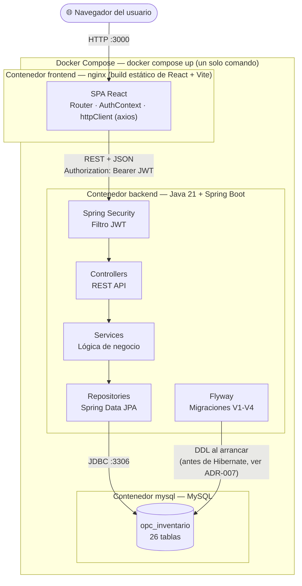
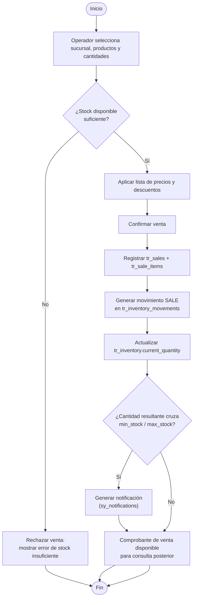
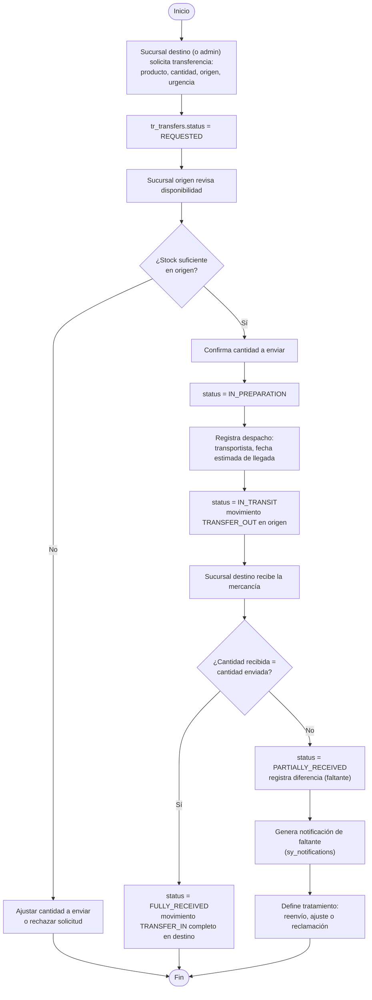

# Diagramas de Ingeniería

> Responde a la sección 7.1 de `Prueba Tecnica Inventario.pdf`: diagrama de casos de uso, diagrama de actividades/flujo (mínimo venta y transferencia), diagrama de arquitectura y diagrama entidad-relación.
> El diagrama **E-R** ya vive en [`database/docs/DER.md`](../database/docs/DER.md) — no se repite aquí para no duplicar contenido; este documento cubre los otros 3.
> Todos los diagramas están en Mermaid (herramienta sugerida por el propio PDF), renderizables directamente en GitHub y en cualquier visor compatible.

---

## 1. Diagrama de casos de uso

Actores tomados de `Analisis_Requerimientos.md` sección 7, agrupados por módulo funcional (secciones 3.1-3.6 del PDF) más las dos funcionalidades adicionales elegidas (Alertas y Auditoría).

```mermaid
flowchart LR
    AdminGeneral(["👤 Administrador general"])
    GerenteSucursal(["👤 Gerente de sucursal"])
    OperadorInventario(["👤 Operador de inventario"])
    SistemaExterno(["🔌 Sistema externo (opcional)"])

    subgraph Inventario["Inventario (3.1)"]
        UC1(("Ver catálogo e inventario propio"))
        UC2(("Consultar inventario de otra sucursal"))
        UC3(("Registrar ingreso / retiro de stock"))
        UC4(("Configurar stock mínimo y máximo"))
    end

    subgraph Compras["Compras (3.2)"]
        UC5(("Crear orden de compra"))
        UC6(("Registrar recepción de mercancía"))
        UC7(("Consultar histórico de compras"))
    end

    subgraph Ventas["Ventas (3.3)"]
        UC8(("Registrar venta"))
        UC9(("Gestionar listas de precios"))
    end

    subgraph Transferencias["Transferencias (3.4)"]
        UC10(("Solicitar transferencia"))
        UC11(("Preparar y despachar envío"))
        UC12(("Confirmar recepción completa/parcial"))
    end

    subgraph Logistica["Logística (3.5)"]
        UC13(("Clasificar rutas por prioridad"))
        UC14(("Consultar cumplimiento logístico"))
    end

    subgraph Dashboard["Dashboard (3.6)"]
        UC15(("Ver KPIs de su sucursal"))
        UC16(("Ver comparativa entre sucursales"))
    end

    subgraph Sistema["Alertas y Auditoría (sección 4)"]
        UC17(("Recibir notificaciones de stock"))
        UC18(("Consultar log de auditoría"))
    end

    subgraph Administracion["Administración"]
        UC19(("Gestionar usuarios y roles"))
        UC20(("Gestionar sucursales"))
    end

    OperadorInventario --> UC1
    OperadorInventario --> UC2
    OperadorInventario --> UC3
    OperadorInventario --> UC5
    OperadorInventario --> UC6
    OperadorInventario --> UC8
    OperadorInventario --> UC10
    OperadorInventario --> UC17

    GerenteSucursal --> UC1
    GerenteSucursal --> UC2
    GerenteSucursal --> UC4
    GerenteSucursal --> UC7
    GerenteSucursal --> UC9
    GerenteSucursal --> UC11
    GerenteSucursal --> UC12
    GerenteSucursal --> UC14
    GerenteSucursal --> UC15
    GerenteSucursal --> UC17

    AdminGeneral --> UC16
    AdminGeneral --> UC18
    AdminGeneral --> UC19
    AdminGeneral --> UC20
    AdminGeneral -.->|"visibilidad total sobre todos los módulos"| Inventario
    AdminGeneral -.-> Compras
    AdminGeneral -.-> Ventas
    AdminGeneral -.-> Transferencias

    SistemaExterno -.->|"vía API REST (punto de extensión, no implementado)"| UC8
```

**Nota:** `Administrador general` tiene acceso implícito a todos los casos de uso de los demás roles (no se dibujan todas las líneas para no saturar el diagrama) — es la misma regla ya documentada para `ma_user_branch` (no necesita fila de acceso explícita, ve todas las sucursales por rol).

---

## 2. Diagrama de arquitectura

Vista técnica de capas, servicios y base de datos, más el límite de cada contenedor Docker (sección 8.1 del PDF).

**Justificación de cada flecha:** el navegador nunca habla directo con MySQL ni con la lógica de negocio — todo pasa por la API REST del backend (regla técnica obligatoria, sección 5 del PDF: "no se acepta lógica de negocio en el cliente"). Dentro del backend, `Security` es lo primero que toca cada request (valida el JWT antes de llegar a cualquier `Controller`). `Flyway` tiene su propia flecha a la BD porque corre **antes** que el resto del backend, no como parte del flujo de una petición.

---

## 3. Diagrama de actividades — Flujo de venta

Cubre el "camino feliz" y el camino de error (stock insuficiente), según lo diseñado en `Analisis_Requerimientos.md` sección 2.4.

---

## 4. Diagrama de actividades — Flujo de transferencia entre sucursales

Los 5 pasos exactos de la sección 3.4 del PDF, incluyendo el camino de recepción parcial, según lo diseñado en `Analisis_Requerimientos.md` sección 2.5.

---

## 5. Diagrama entidad-relación

Ver [`database/docs/DER.md`](../database/docs/DER.md) — no se duplica aquí.
